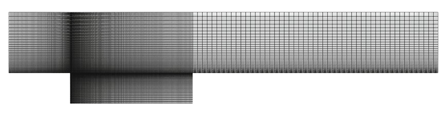

<!-- ---

title: "Use Case 7.2 – Shell-and-Tube Heat Exchanger" linkTitle: "7.2
Shell-and-Tube Heat Exchanger" weight: 72 description: "Industrial use case
demonstrating conjugate heat transfer (CHT) in a shell-and-tube heat exchanger
using the multiRegionFoam solver."

--- -->

# 7.2 Shell-and-Tube Heat Exchanger

The next example demonstrates an industrial application where conjugate heat
transfer (CHT) takes place.

<!--  -->

<!-- <figure style="text-align: center;">
  
  <figcaption><strong> Figure 1:</strong>Geometry of the shell-and-tube heat exchanger</figcaption>
</figure> -->

This particular design includes a shell, tubes, and baffles. Heat transfer
occurs between two fluids—an **inner fluid**, flowing at a lower temperature
inside the tubes, and an **outer fluid**, flowing within the shell but outside
the tubes. The solid walls of the tubes ensure that the two fluids do not mix,
while the baffles help direct the flow on the shell side.

The case setup is based on a configuration prepared by **SimScale GmbH**,
publicly available at
[SimScale Project Repository](https://www.simscale.com/projects/cheunglucia/heat_exchanger_-_cht_simulation/).

<figure style="text-align: center;">
  
  <figcaption><strong> Figure 2:</strong>Computational mesh of the heat exchanger</figcaption>
</figure>

The computational mesh is shown in Figure 7.2.2, and the boundary conditions are
summarized in **Table 7.**  
The **coupled boundary conditions** are the same as in the previous case (see
Table 3 in Section 7.1).

The **material properties** of the solid and fluid regions are listed in **Table
8**, where both the inner and outer fluids have identical thermophysical
properties.

The simulations were run for **500 seconds** with a **time step size of Δt = 1
s**.  
The **numerical schemes** used are listed in **Table 9**.

The results of the heat exchanger simulation using **monolithic coupling** are
shown below.

<!--  -->

<figure style="text-align: center;">
  
  <figcaption><strong> Figure 3:</strong>Final temperature distribution for the heat exchanger simulation</figcaption>
</figure>

It depicts the distribution of the temperature field at **t = 30 s**, after
which no significant change in temperature is observed.  
When using **partitioned coupling**, the computed field values were found to be
similar, but the system required longer to reach a steady state (approximately
**t = 500 s**).

 



| **Boundary**    | **Thermal**  | **Velocity**     |
| --------------- | ------------ | ---------------- |
| **Inner fluid** |              |                  |
| inlet           | 283 K        | (0.002 0 0) m/s  |
| inner_to_solid  | coupled      | (0 0 0) m/s      |
| outlet, walls   | zeroGradient | zeroGradient     |
| **Outer fluid** |              |                  |
| inlet           | 353 K        | (0 0.0037 0) m/s |
| outer_to_solid  | coupled      | (0 0 0) m/s      |
| outlet, walls   | zeroGradient | zeroGradient     |
| **Solid**       |              |                  |
| solid_to_inner  | coupled      | –                |
| solid_to_outer  | coupled      | –                |
| walls           | zeroGradient | –                |





<strong>Table 7:</strong>  Boundary Conditions for the Heat Exchanger oundary Conditions for the Heat



---



| **Property**           | **Symbol** | **Unit** | **Fluid** | **Solid** |
| ---------------------- | ---------- | -------- | --------- | --------- |
| Density                | ρ          | kg/m³    | 1027      | 8960      |
| Thermal conductivity   | k          | W/m·K    | 0.668     | 401       |
| Dynamic viscosity      | μ          | kg/ms    | 3.645e−4  | –         |
| Specific heat capacity | cp         | J/kg·K   | 4195      | 385       |





<strong>Table 8:</strong>Thermophysical Properties of the Fluid and Solid



---



| **Scheme**             | **Setting**                  |
| ---------------------- | ---------------------------- |
| Time scheme            | `ddtScheme steadyState`      |
| Finite volume schemes  |                              |
| `gradScheme`           | `Gauss linear`               |
| `gradScheme grad(U)`   | `cellLimited Gauss linear 1` |
| `divScheme div(phi,U)` | `Gauss upwind`               |
| `divScheme div(phi,T)` | `Gauss upwind`               |
| `laplacianScheme`      | `Gauss linear corrected`     |
| `interpolationScheme`  | `linear`                     |
| `snGradScheme`         | `corrected`                  |





<strong>Table 8:</strong>Numerical Schemes for the Heat Exchanger



---

## Discussion

- The **monolithic coupling** method produced results nearly identical to the
  **partitioned approach**, but achieved **faster convergence**.
- Both approaches exhibited stable performance, though the partitioned case
  required a longer simulation time to reach equilibrium.
- This case effectively demonstrates the applicability of the
  **multiRegionFoam** framework for complex conjugate heat transfer problems in
  industrial-scale geometries.

<!-- ## Assets to Add

| **Asset ID** | **Description**                                                  | **Suggested Filename**    |
| ------------ | ---------------------------------------------------------------- | ------------------------- |
| Image 7.2.1  | Geometry of the shell-and-tube heat exchanger                    | `images/usecase7_2_1.png` |
| Image 7.2.2  | Computational mesh of the heat exchanger                         | `images/usecase7_2_2.png` |
| Image 7.2.3  | Final temperature distribution for the heat exchanger simulation | `images/usecase7_2_3.png` |
| Table 7      | Boundary conditions for the heat exchanger                       | —                         |
| Table 8      | Thermophysical properties of the fluid and solid                 | —                         |
| Table 9      | Numerical schemes for the heat exchanger                         | —                         |

--- -->

## References

[73] SimScale GmbH. “Heat Exchanger – CHT Simulation.” Available
at:[https://www.simscale.com/projects/cheunglucia/heat*exchanger*-\_cht_simulation/](https://www.simscale.com/projects/cheunglucia/heat_exchanger_-_cht_simulation/)

---

